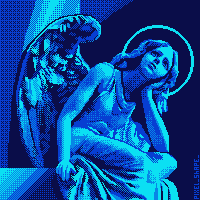
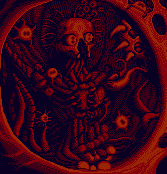
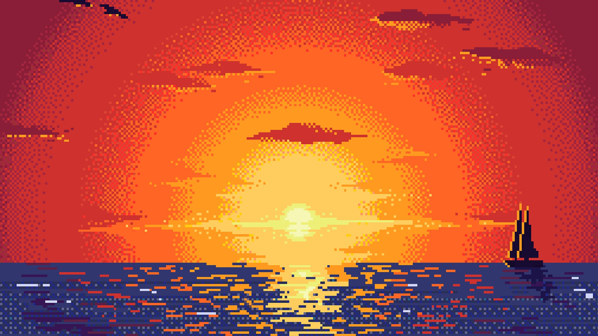
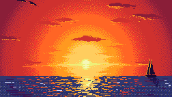

# Migraine

Migraine is a tool that restores pixel art from upscaled and/or compressed state into its original state preserving size and colors as close as possible.

## Introduction

My girlfriend loves crocheting. And she loves to crochet pixel art. Unfortunately, most pixel art on the internet is not "pixel-perfect" in a sence that it's upscaled and pixel edges are a blurry mess. But each column in crochet has to correspond to a single pixel with defined color.

Finally, I got tired of counting pixel art resolution, resizing, cropping, posterizing, fixing colors and so on. So decided to create a simple CLI tool that will do all that work for me with a single instruction.

Initial version was written in Scala, but the startup time was greater than the image processing part... So I switched to Rust and got almost 20x boost in execution speed.

## Usage

Binary has only one required argument - path to the image.

```sh
migraine ./image.jpg
```

This will try its best of inferring all aspects of the image and write restored pixel art into `./image.jpg_downsampled.bmp`.

You can also provide optional arguments if you know exact dimensions or number of colors in original pixel art. All of the options can be viewed by running:

```sh
migraine -h
```

## Examples

<div class="grid">
<div class="preview angel"> </div>
<div class="preview angel"> </div>
<div class="preview sailor"></div>
<div class="preview sailor"></div>
<div class="preview skull"> </div>
<div class="preview skull"> </div>
<div class="preview sunset"></div>
<div class="preview sunset"></div>
</div>

<style>
  .grid {
    display: grid;
    grid-template-rows: repeat(2, auto);
    grid-auto-flow: column;
    grid-auto-columns: minmax(16rem, 1fr);
    gap: 1rem;
  }
  .preview {
    width: 16rem;
    height: 16rem;
    overflow: hidden;
  }
  .preview > img {
    max-height: unset;
    image-rendering: optimizeSpeed;
    image-rendering: pixelated;
  }
  .preview.angel > img {
    min-width: 2000px;
    transform: translate(-74%, -25%);
  }
  .preview.sailor > img {
    min-width: 1600px;
    transform: translate(-31%, -33%);
  }
  .preview.skull > img {
    min-width: 2000px;
    transform: translate(-22%, -64%);
  }
  .preview.sunset > img {
    min-width: 4000px;
    transform: translate(-77%, -40%);
  }
</style>
